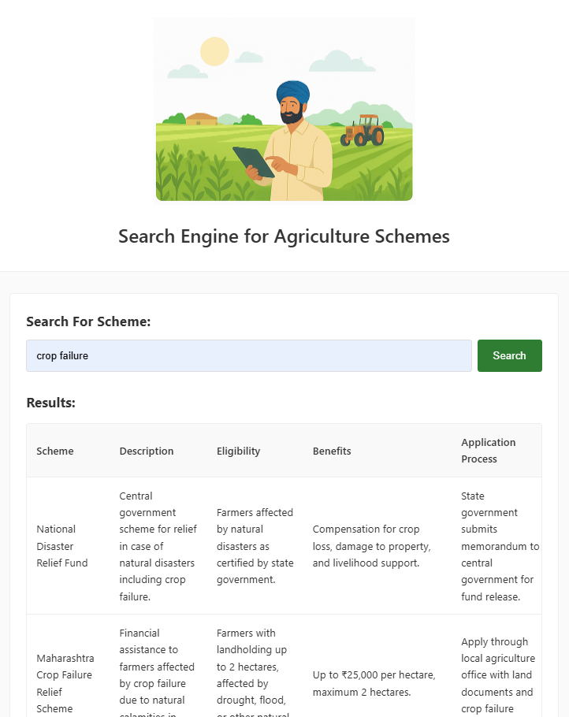

*This image shows the actual appearance of the project.*




---

# Python Environment Setup:

This guide helps you install the necessary Python packages to run the project.

---

## Required Packages:

The project uses the following Python packages:

- **Flask** → for web development  
- **pandas** → for data manipulation  
- **nltk** → for natural language processing  
- **openpyxl** → to read/write Excel `.xlsx` files

---

## Installation:

Open your terminal or command prompt and run the following commands:

### 1. Install Flask, NLTK, pandas and openpyxl

```bash
pip install flask pandas nltk
pip install pandas openpyxl
